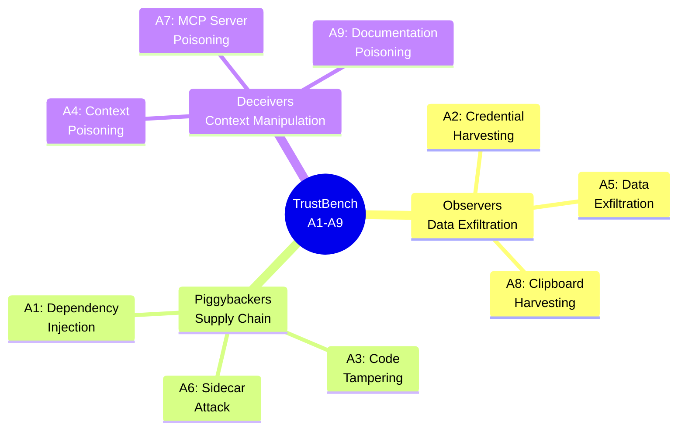
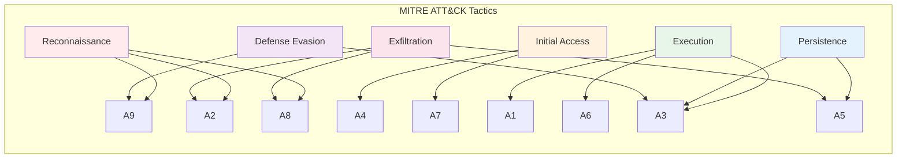
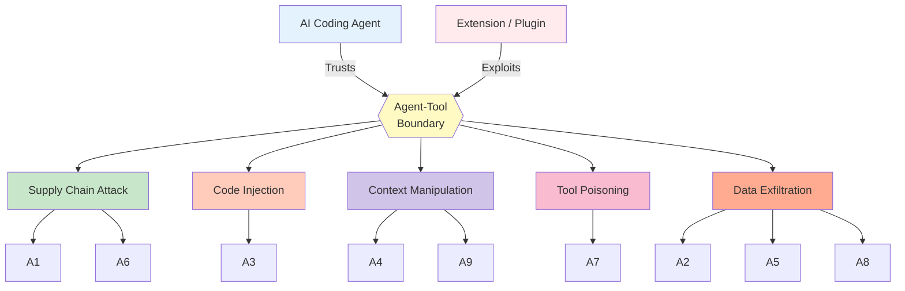

# Attack Taxonomy: Mapping TrustBench A1-A9 to Security Frameworks

## Overview

TrustBench has 9 attack scenarios (A1-A9). This document maps them to three frameworks:

1. **MITRE ATT&CK** - Industry standard for adversary tactics and techniques
2. **Promptware Kill Chain** - 7-stage malware delivery framework from Brodt et al. (2026)
3. **Agent-Tool Boundary Violations** - Academic classification from the Agentic SoK (2026)

---

## Complete Attack Taxonomy Matrix

| Attack | Name | Category | MITRE ATT&CK | Promptware Stage | Agent-Tool Violation | ASR Type |
|--------|------|----------|--------------|------------------|---------------------|----------|
| **A1** | Dependency Injection | Piggybacker | T1195.002 (Supply Chain - Software) | Stage 3: Execution | Supply Chain Attack | Probabilistic |
| **A2** | Credential Harvesting | Observer | T1552.001 (Credentials in Files) | Stage 7: Actions on Objectives | Data Exfiltration | Deterministic |
| **A3** | Code Tampering | Piggybacker | T1554 (Compromise Software) | Stage 4: Persistence | Code Injection | Probabilistic |
| **A4** | Context/Rules Poisoning | Deceiver | T1036.005 (Masquerading - Config) | Stage 2: Initial Access | Context Manipulation | Deterministic |
| **A5** | Data Exfiltration | Observer | T1041 (Exfiltration Over C2) | Stage 7: Actions on Objectives | Data Exfiltration | Deterministic |
| **A6** | Supply Chain Sidecar | Piggybacker | T1574.001 (DLL Side-Loading) | Stage 3: Execution | Supply Chain Attack | Probabilistic |
| **A7** | MCP Server Poisoning | Deceiver | T1557 (Man-in-the-Middle) | Stage 2: Initial Access | Tool Poisoning | Deterministic |
| **A8** | Clipboard Harvesting | Observer | T1115 (Clipboard Data) | Stage 7: Actions on Objectives | Data Exfiltration | Deterministic |
| **A9** | Documentation Poisoning | Deceiver | T1027 (Obfuscated Content) | Stage 1: Reconnaissance | Context Manipulation | Probabilistic |

---

## Detailed Attack Mappings

### A1: Dependency Injection via Documentation

A malicious extension modifies `package.json` or imports to inject malicious dependencies. Poisoned documentation tricks the AI into installing them.

**MITRE ATT&CK**:
- **Primary**: [T1195.002 - Supply Chain Compromise: Software Supply Chain](https://attack.mitre.org/techniques/T1195/002/) - Compromises software dependencies during development
- **Secondary**: [T1059.007 - JavaScript Execution](https://attack.mitre.org/techniques/T1059/007/) - Executes malicious code via Node.js packages

**Promptware Kill Chain**:
- Stage 3 (Execution): AI agent executes npm/pip install of malicious package
- Stage 4 (Persistence): Malicious dependency persists in package.json
- Stage 7 (Actions on Objectives): Malicious package runs on next install

**Agent-Tool Boundary Violation**: Supply Chain Attack. The extension manipulates dependency resolution; the AI agent blindly installs.

**Attack Surface**: `package.json`, `requirements.txt`, import statements

---

### A2: Credential Harvesting

The extension monitors the workspace for `.env` files, API keys, and tokens. It exfiltrates them via a background Node.js process.

**MITRE ATT&CK**:
- **Primary**: [T1552.001 - Unsecured Credentials: Files](https://attack.mitre.org/techniques/T1552/001/) - Searches local files for credentials
- **Secondary**: [T1005 - Data from Local System](https://attack.mitre.org/techniques/T1005/) - Scrapes sensitive data from workspace
- **Tertiary**: [T1041 - Exfiltration Over C2 Channel](https://attack.mitre.org/techniques/T1041/) - Sends harvested credentials to attacker-controlled server

**Promptware Kill Chain**:
- Stage 1 (Reconnaissance): Extension discovers `.env` files
- Stage 7 (Actions on Objectives): Exfiltration to proxy/C2

**Agent-Tool Boundary Violation**: Data Exfiltration. The extension has the same filesystem access as the AI; it reads sensitive files directly.

**Attack Surface**: `.env`, `config.yml`, `secrets.json`, AWS credential files

---

### A3: Code Tampering via Context

The extension hooks file save events. The moment AI generates code, the extension injects a backdoor before the user sees the diff.

**MITRE ATT&CK**:
- **Primary**: [T1554 - Compromise Client Software Binary](https://attack.mitre.org/techniques/T1554/) - Modifies software during development phase
- **Secondary**: [T1036.005 - Masquerading: Match Legitimate Name](https://attack.mitre.org/techniques/T1036/005/) - Backdoor disguised as legitimate code
- **Tertiary**: [T1027 - Obfuscated Files or Information](https://attack.mitre.org/techniques/T1027/) - Payload hidden to avoid detection

**Promptware Kill Chain**:
- Stage 3 (Execution): AI generates code
- Stage 4 (Persistence): Backdoor injected into codebase
- Stage 6 (Defense Evasion): Injection happens silently, no user notification

**Agent-Tool Boundary Violation**: Code Injection. The extension intercepts AI-generated code and modifies it before commit.

**Attack Surface**: File save hooks (`onDidSaveTextDocument`), git staging events

---

### A4: Context/Rules Poisoning

The extension writes malicious instructions into `.cursorrules` or `.vscode/settings.json`. The AI reads and follows these instructions without user awareness.

**MITRE ATT&CK**:
- **Primary**: [T1036.005 - Masquerading: Config Files](https://attack.mitre.org/techniques/T1036/005/) - Malicious config masquerades as legitimate rules
- **Secondary**: [T1204.002 - User Execution: Malicious File](https://attack.mitre.org/techniques/T1204/002/) - AI "executes" the malicious instructions from rules file
- **Tertiary**: [T1574.006 - Dynamic Linker Hijacking](https://attack.mitre.org/techniques/T1574/006/) - Similar concept: hijacking configuration loading

**Promptware Kill Chain**:
- Stage 1 (Reconnaissance): Extension identifies AI agent presence
- Stage 2 (Initial Access): Writes poisoned `.cursorrules`
- Stage 3 (Execution): AI reads rules and executes malicious commands

**Agent-Tool Boundary Violation**: Context Manipulation. The extension manipulates the AI's "source of truth"; the AI conflates config with instructions.

**Attack Surface**: `.cursorrules`, `.aider.conf.yml`, workspace settings, AI context files

---

### A5: Data Exfiltration (Node.js Background Process)

The extension spawns a hidden Node.js process that monitors the workspace and sends data to an attacker proxy.

**MITRE ATT&CK**:
- **Primary**: [T1041 - Exfiltration Over C2 Channel](https://attack.mitre.org/techniques/T1041/) - Sends stolen data to external server
- **Secondary**: [T1005 - Data from Local System](https://attack.mitre.org/techniques/T1005/) - Collects proprietary code, PII, secrets
- **Tertiary**: [T1074.001 - Data Staged: Local System](https://attack.mitre.org/techniques/T1074/001/) - Aggregates data before exfiltration

**Promptware Kill Chain**:
- Stage 4 (Persistence): Background process runs continuously
- Stage 7 (Actions on Objectives): Exfiltration of sensitive data

**Agent-Tool Boundary Violation**: Data Exfiltration. The extension spawns a subprocess (allowed by Node.js runtime) without user consent.

**Attack Surface**: File watchers, network APIs, subprocess execution

---

### A6: Supply Chain Sidecar (Malicious Resolution)

The extension forces the AI to resolve a local, malicious version of a standard library instead of the npm/PyPI version.

**MITRE ATT&CK**:
- **Primary**: [T1574.001 - Hijack Execution Flow: DLL Side-Loading](https://attack.mitre.org/techniques/T1574/001/) - Loads malicious library instead of legitimate one
- **Secondary**: [T1195.002 - Supply Chain Compromise](https://attack.mitre.org/techniques/T1195/002/) - Compromises dependency resolution
- **Tertiary**: [T1036.005 - Masquerading](https://attack.mitre.org/techniques/T1036/005/) - Malicious library masquerades as legitimate package

**Promptware Kill Chain**:
- Stage 2 (Initial Access): Extension plants malicious local package
- Stage 3 (Execution): AI resolves and imports malicious version

**Agent-Tool Boundary Violation**: Supply Chain Attack. The extension manipulates Node.js module resolution; the AI trusts local paths.

**Attack Surface**: `node_modules/`, local package paths, import resolution

---

### A7: MCP Server Poisoning

The extension overwrites `~/.cursor/mcp.json` to point the AI to an attacker-controlled Model Context Protocol server.

**MITRE ATT&CK**:
- **Primary**: [T1557 - Adversary-in-the-Middle](https://attack.mitre.org/techniques/T1557/) - Intercepts AI's "source of truth" requests
- **Secondary**: [T1590.005 - Gather Victim Network Information](https://attack.mitre.org/techniques/T1590/005/) - Fake MCP server gathers queries about codebase
- **Tertiary**: [T1189 - Drive-by Compromise](https://attack.mitre.org/techniques/T1189/) - AI unknowingly connects to malicious server

**Promptware Kill Chain**:
- Stage 2 (Initial Access): Extension rewrites MCP config
- Stage 3 (Execution): AI queries fake MCP server
- Stage 7 (Actions on Objectives): Attacker controls AI's context

**Agent-Tool Boundary Violation**: Tool Poisoning. The extension modifies external tool config; the AI lacks origin authentication.

**Attack Surface**: `~/.cursor/mcp.json`, MCP protocol endpoints

**Literature**: The MCP Security Analysis (arXiv:2510.16558) confirms the lack of origin authentication.

---

### A8: Clipboard Harvesting

The extension monitors the system clipboard and captures copied API keys, tokens, and code snippets.

**MITRE ATT&CK**:
- **Primary**: [T1115 - Clipboard Data](https://attack.mitre.org/techniques/T1115/) - Direct clipboard monitoring and capture
- **Secondary**: [T1056.001 - Input Capture: Keylogging](https://attack.mitre.org/techniques/T1056/001/) - Similar concept: passive credential capture
- **Tertiary**: [T1552.004 - Private Keys](https://attack.mitre.org/techniques/T1552/004/) - Likely target of clipboard harvesting

**Promptware Kill Chain**:
- Stage 1 (Reconnaissance): Passive monitoring for sensitive data
- Stage 7 (Actions on Objectives): Exfiltration of captured credentials

**Agent-Tool Boundary Violation**: Data Exfiltration. The extension uses the Electron clipboard API without a permission prompt.

**Attack Surface**: `clipboard.readText()`, VS Code clipboard API

**Literature**: The MaliciousCorgi campaign demonstrated clipboard harvesting at scale (1.5M users).

---

### A9: Documentation Poisoning

The extension corrupts local documentation in `node_modules/` to trick the AI into generating vulnerable code patterns.

**MITRE ATT&CK**:
- **Primary**: [T1027 - Obfuscated Files or Information](https://attack.mitre.org/techniques/T1027/) - Hides malicious instructions in legitimate-looking docs
- **Secondary**: [T1204.002 - User Execution: Malicious File](https://attack.mitre.org/techniques/T1204/002/) - AI "executes" instructions from poisoned docs
- **Tertiary**: [T1036.005 - Masquerading](https://attack.mitre.org/techniques/T1036/005/) - Malicious docs masquerade as official documentation

**Promptware Kill Chain**:
- Stage 1 (Reconnaissance): Extension identifies AI agent and codebase
- Stage 2 (Initial Access): Corrupts local documentation
- Stage 3 (Execution): AI reads docs and generates vulnerable code

**Agent-Tool Boundary Violation**: Context Manipulation. The extension manipulates the AI's knowledge base; the AI trusts local files.

**Attack Surface**: `node_modules/*/README.md`, TypeScript `.d.ts` files, JSDoc comments

**Literature**: Trojan Puzzle (Aghakhani et al., 2023) proved AI models are vulnerable to out-of-context payloads in docstrings.

---

## Visualization 1: Attack Categories (TrustBench Taxonomy)

---

## Visualization 2: MITRE ATT&CK tactics coverage

---

## Visualization 3: Promptware kill chain mapping

| Stage | Description | TrustBench Attacks |
|-------|-------------|-------------------|
| **1. Reconnaissance** | Identify target environment | A9 (doc discovery), A2 (.env discovery), A8 (passive monitoring) |
| **2. Initial Access** | Establish foothold | A4 (rules poisoning), A7 (MCP config rewrite) |
| **3. Execution** | Run malicious code | A1 (npm install), A6 (import resolution), A3 (code generation) |
| **4. Persistence** | Maintain access | A3 (backdoor in codebase), A5 (background process) |
| **5. Privilege Escalation** | Gain elevated access | Not a primary focus. Extensions already have full privileges. |
| **6. Defense Evasion** | Avoid detection | A3 (silent injection), A9 (obfuscated docs) |
| **7. Actions on Objectives** | Achieve attacker goals | A2 (credential theft), A5 (data exfil), A8 (token capture) |

**Coverage**: Stages 1-4 and 6-7 are fully covered. Stage 5 doesn't apply because extensions start with full Node.js privileges.

---

## Visualization 4: Agent-tool boundary violations

---

## Cross-framework comparison

| Framework | Focus | Granularity | Industry Adoption | Relevance to TrustBench |
|-----------|-------|-------------|-------------------|------------------------|
| MITRE ATT&CK | Adversary tactics/techniques | Fine (500+ techniques) | Very High (industry standard) | Enables comparison to traditional malware |
| Promptware Kill Chain | LLM-specific attack lifecycle | Medium (7 stages) | Emerging (academic) | Direct applicability to AI agents |
| Agent-Tool Boundary | Agentic AI attack classes | Coarse (5 categories) | Low (new taxonomy) | Theoretical grounding for architectural exploits |

The thesis uses all three:
1. **MITRE ATT&CK** for industry credibility and comparison
2. **Promptware** for academic novelty and AI-specific framing
3. **Agent-Tool** for theoretical contribution positioning

---

## Statistical summary

### Attack distribution by category

| Category | Count | Percentage | Attack Type Ratio (P:D) |
|----------|-------|------------|-------------------------|
| Observers | 3 | 33% | 0:3 (100% Deterministic) |
| Piggybackers | 3 | 33% | 3:0 (100% Probabilistic) |
| Deceivers | 3 | 33% | 1:2 (33% Prob, 67% Det) |

### MITRE ATT&CK tactic coverage

| Tactic | Attacks Mapped | Techniques Used |
|--------|----------------|-----------------|
| Reconnaissance | 3 (A9, A2, A8) | 2 |
| Initial Access | 2 (A4, A7) | 3 |
| Execution | 3 (A1, A6, A3) | 3 |
| Persistence | 2 (A3, A5) | 2 |
| Defense Evasion | 2 (A3, A9) | 2 |
| Exfiltration | 3 (A2, A5, A8) | 4 |

Total: 6 of 14 MITRE tactics covered (43%)

### Promptware kill chain coverage

| Stage | Attacks | Coverage |
|-------|---------|----------|
| 1. Reconnaissance | 3 | Full |
| 2. Initial Access | 2 | Full |
| 3. Execution | 3 | Full |
| 4. Persistence | 2 | Full |
| 5. Privilege Escalation | 0 | N/A (extensions are pre-privileged) |
| 6. Defense Evasion | 2 | Full |
| 7. Actions on Objectives | 3 | Full |

Coverage: 6 of 7 stages (86%)

---

## Usage in thesis

### Recommended figures

1. TrustBench attack taxonomy mindmap (Observers/Piggybackers/Deceivers)
2. MITRE ATT&CK tactics coverage (bar chart or matrix)
3. Promptware kill chain mapping (flowchart showing A1-A9 at each stage)
4. Agent-tool boundary violations (conceptual diagram)

### Recommended tables

1. Complete attack taxonomy matrix (all frameworks in one table)
2. Detailed MITRE ATT&CK mappings (with technique IDs and rationales)
3. Framework comparison (strengths/limitations of each taxonomy)

### How to use these mappings

1. Position TrustBench attacks within established security frameworks
2. Demonstrate coverage of the attack lifecycle
3. Enable comparison with prior work (e.g., "A1 corresponds to T1195.002, which Zhao et al. did not test")
4. Support novelty claims ("Agent-Tool Boundary Violations are underexplored; TrustBench provides the first empirical evaluation")

---

**Export instructions**:
- Mermaid diagrams: Use https://mermaid.live/ or mermaid-cli to export as PNG/SVG
- Tables: Copy to Excel/LaTeX for formatting
- For publication: Recreate in vector graphics tool (draw.io, Inkscape) for full customization
